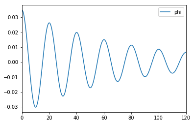

class: center, middle

# DEMOPS: Roll decay

Blablablab...

---

# Roll decay...

bla vlas

---

## Simulation of roll decay

---
# Roll decay equation

## Linear model

--
$$\omega_{0}^{2}\phi
+2\omega_0\zeta\dot{\phi}+\ddot{\phi}=0$$

---


```python
equations.velocity_equation_linear
```


$\displaystyle \frac{d}{d t} \phi{\left(t \right)} = \operatorname{p_{old}}{\left(t \right)}$


```python
equations.acceleration_equation_linear
```


$\displaystyle \frac{d^{2}}{d t^{2}} \phi{\left(t \right)} = - \omega_{0} \left(\omega_{0} \phi_{old}{\left(t \right)} + 2 \zeta \operatorname{p_{old}}{\left(t \right)}\right)$


```python
## Save to tex
conatiner = pylatex_extenders.GeneralContainer()
math = pylatex_extenders.Equation(equations.roll_diff_equation,label='eq:rollDiffEquationQuadratic')
conatiner.append(math)
file_path = os.path.join(latex_helpers.general_content_path,'roll_diff_equation_quadratic')
conatiner.generate_tex(file_path)
```


```python
sp.solve(equations.roll_diff_equation,phi_dot_dot)
```


    [-d*Abs(Derivative(phi(t), t))*Derivative(phi(t), t) - omega0**2*phi(t) - 2*omega0*zeta*Derivative(phi(t), t)]


```python
equations.velocity_equation
```


$\displaystyle \frac{d}{d t} \phi{\left(t \right)} = \operatorname{p_{old}}{\left(t \right)}$


```python
equations.acceleration_equation
```


$\displaystyle \frac{d^{2}}{d t^{2}} \phi{\left(t \right)} = - d \operatorname{p_{old}}{\left(t \right)} \left|{\operatorname{p_{old}}{\left(t \right)}}\right| - \omega_{0}^{2} \phi_{old}{\left(t \right)} - 2 \omega_{0} \zeta \operatorname{p_{old}}{\left(t \right)}$


## Example: Analytically solve simpler equation


```python
t = sp.Symbol('t')
y = me.dynamicsymbols('y')
y

```


$\displaystyle y{\left(t \right)}$


```python
eq = sp.Eq(lhs=y.diff().diff(), rhs=-9.81)
eq
```


$\displaystyle \frac{d^{2}}{d t^{2}} y{\left(t \right)} = -9.81$


```python
sp.dsolve(eq)
```


$\displaystyle y{\left(t \right)} = C_{1} + C_{2} t - \frac{981 t^{2}}{200}$


```python
eq2 = sp.Eq(lhs=y.diff().diff(), rhs=-9.81 + 0.1*y.diff())
sp.dsolve(eq2)
```


$\displaystyle y{\left(t \right)} = C_{1} + C_{2} e^{0.1 t} + 98.1 t$


```python
%matplotlib inline
%load_ext autoreload
%autoreload 2
```


```python
import numpy as np
import pandas as pd
import matplotlib.pyplot as plt
from rolldecayestimators.equations_lambdify import calculate_acceleration, calculate_velocity
from rolldecayestimators.simulation import roll_decay_time_step,simulate
import rolldecay
import inspect
```
---

```python
from numpy import abs
```


```python
phi0 = np.deg2rad(2)
phi1d0 = 0

states0 = [phi0,phi1d0]
d = 0.076
T0 = 20
omega0 = 2*np.pi/T0
zeta = 0.044

N = 1000
t = np.linspace(0,120,N)

df = simulate(t=t, phi0=phi0, phi1d0=phi1d0, omega0=omega0, d=d, zeta=zeta)
```


```python
fig,ax = plt.subplots()
df.plot(y='phi', ax=ax);
```
--



---

```python
print(inspect.getsource(calculate_acceleration))

```

    def _lambdifygenerated(d, omega0, p_old, phi_old, zeta):
        return (-d*p_old*abs(p_old) - omega0**2*phi_old - 2*omega0*p_old*zeta)
    


```python
print(inspect.getsource(calculate_velocity))
```

    def _lambdifygenerated(p_old):
        return (p_old)
    


```python

```


```python

```
